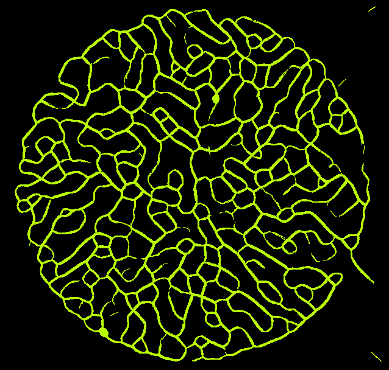

# Particle Engine for Emulating Slime Mold Behavior
Inspired by [this video](https://www.youtube.com/watch?v=X-iSQQgOd1A)

Will generate a stream of particles that will interact with each other to create naturally occuring patterns.

Behavior of the particles can be tuned by modifying the sensing parameters and other things like speed and trail length.

Sample from C++ build


Note: The Java version is significatly less developed due to performance issues at scale.

## Getting Started
First `cd` into the folder you want to test.

### C++/OpenGL
Note: This was only tested with the `g++` compiler and on Windows.

Download external opengl library files packaged [here](https://drive.google.com/file/d/1o-iBxV4G21DgOM9j0POSwd5c7WJuBV6C/view?usp=sharing) and extract them into the `cpp` folder.

```sh
g++ -g -std=c++17 -IC:include -LC:lib src/*.cpp -lglfw3dll -lopengl32 -lglew32 -o app.exe
```
```sh
app.exe
```

### Java
Ensured you have Java installed on your system. This code was developed and tested with OpenJDK version 16.0.1

```
java -cp ./bin main.Main
```